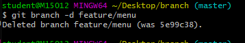

## Git 특강 3일차

## ------

### 수업을 놓쳤지만 이런식으로 하면 오류가 생긴다 => branch를 배워보자

#### branch라는 폴더를 다시 만든다.

그후

기본적으로 master라는 branch에 있다.

branch를 생성한다

feature/menu branch에 들어간후에 menu.txt를 만들고 커밋한후 로그를 본다

다시 master branch에 들어가서 로그를 확인해 보면 Complete menu 커밋 정보가 없다(실제로 사라진거 아님)

merge를 통해 합병한후 로그를 보면 다 나오는걸 알수 있다.

작업해 병합한 branch는 삭제한다.

