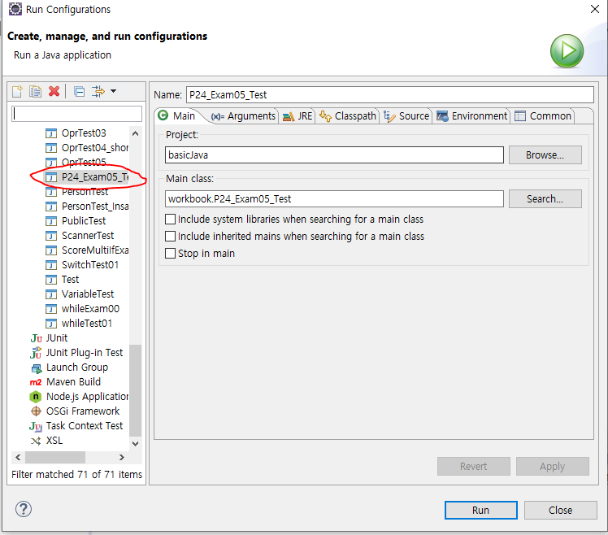
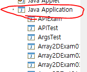
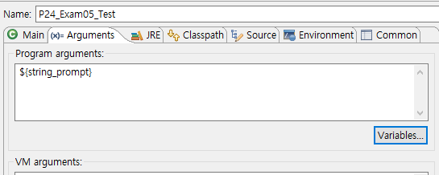

## eclipse argument 사용법

1. run 누르고  run configurations

   

   

※ (파일명이 안뜨는 경우는 실행이 한번도 안된경우 이므로 java Application 더블클릭) 

3. Arguments 항목에서 Program arguments 의 Variables 클릭후 string_prompt 선택

   

