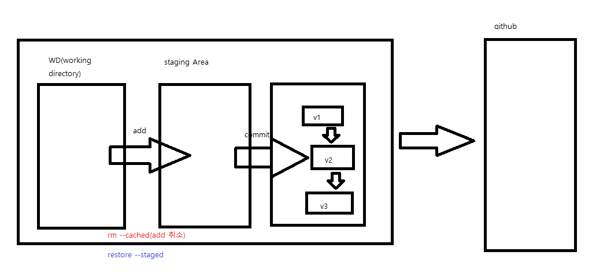
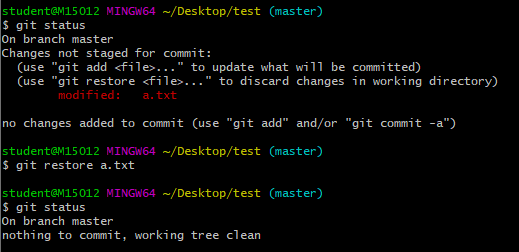
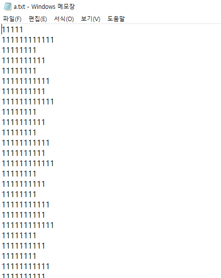
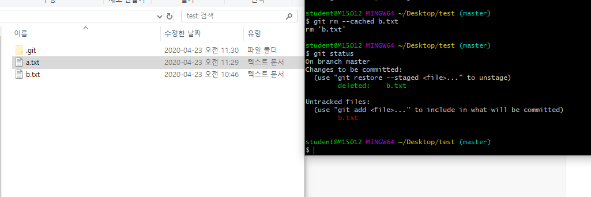
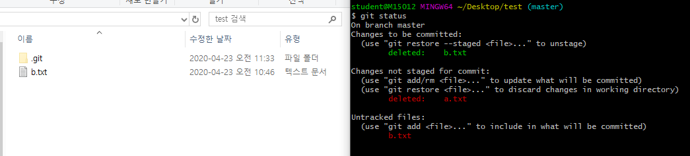

## git특강 두번째


개발자  면접질문 git

https://github.com/JaeYeopHan/Interview_Question_for_Beginner


주니어 개발자 취업정보 git

https://github.com/jojoldu/junior-recruit-scheduler


원격 근무 회사

https://github.com/milooy/remote-or-flexible-work-company-in-korea


웹 백엔드 D2

https://d2.naver.com/news/3435170


좋은 git commit 메시지를 위한 영어 사전

https://blog.ull.im/engineering/2019/03/10/logs-on-git.html


### git => DVCS(분산형 버전관리 시스템)




```bash
$git status //제일 중요해
```


GUI(Graphic user Interface)   vs   CLI(command Line Interface)


* 아무 작업도 안한 상태이다


### touch

```bash
touch a.txt    // a.txt파일 생성
```


다음으로 status를 확인해보면


## Git status를 통해 정리하기

#### 기초 명령어

```bash
# list (파일 목록)
$ ls
# change directory(디렉토리 변경)
$ cd
# 빈 파일 생성
$ touch <파일명>
```


### 상황

### 1. add


```bash
$ touch a.txt

$ git status
On branch master

No commits yet
# 트래킹X. 새로 생성된 파일.
Untracked files:
   # 커밋을 하기 위한 곳에 포함시키려면
   # Staging area로 이동시키려면, git add
  (use "git add <file>..." to include in what will be committed)
        a.txt
# WD O,Staging area X,
nothing added to commit but untracked files present (use "git add" to track)
```


```bash
$ git add a.txt

$ git status
On branch master

No commits yet
# 커밋될 변경사항들 (Staging area O)
Changes to be committed:
  # unstage를 위해서 활용할 명령어 (add 취소)
  (use "git rm --cached <file>..." to unstage)
        new file:   a.txt


```


### 2. commit


```bash
$ git commit -m 'Create a.txt'
[master (root-commit) 6ec392c] Create a.txt
 1 file changed, 0 insertions(+), 0 deletions(-)
 create mode 100644 a.txt

student@M15012 MINGW64 ~/Desktop/test (master)

# 커밋 내용 확인
$ git log
commit 6ec392c77f50075323de8ddd6eada5a864a63283 (HEAD -> master)
Author: yuhwanwoo <6514687@naver.com>
Date:   Thu Apr 23 10:36:20 2020 +0900

    Create a.txt

student@M15012 MINGW64 ~/Desktop/test (master)
$ git log --oneline

```


### 3. 추가 파일 변경 상태


b.txt를 만들고 a.txt수정하고 git status를 하면

```bash
$ touch b.txt

student@M15012 MINGW64 ~/Desktop/test (master)
$ git status
On branch master
Changes not staged for commit:
  (use "git add <file>..." to update what will be committed)
  (use "git restore <file>..." to discard changes in working directory)
        modified:   a.txt

Untracked files:
  (use "git add <file>..." to include in what will be committed)
        b.txt

no changes added to commit (use "git add" and/or "git commit -a")

```


```bash
$ git add a.txt

student@M15012 MINGW64 ~/Desktop/test (master)
$ git status
On branch master
Changes to be committed:
  (use "git restore --staged <file>..." to unstage)
        modified:   a.txt

Untracked files:
  (use "git add <file>..." to include in what will be committed)
        b.txt

```


```bash
$ git add .

student@M15012 MINGW64 ~/Desktop/test (master)
$ git status
On branch master
Changes to be committed:
  (use "git restore --staged <file>..." to unstage)
        modified:   a.txt
        new file:   b.txt

```


```bash
$ git commit -m 'a.txt 수정, b.txt 생성'
[master 02fe725] a.txt 수정, b.txt 생성
 2 files changed, 1 insertion(+)
 create mode 100644 b.txt

```


a.txt와 b.txt를 수정한다.


### 4. 커밋 메시지 변경

> 주의!! 커밋 메시지 변경시 해시값 자체가 변경되어, 이미 원격저장소에 push한 이력에 대해서는 메시지 변경을 하면 안된다.


```bash
$ git commit --amend
```

* vim 텍스트 편집기가 실행된다.
  * i : 편집 모드
  * esc : 편집모드를 종료하고, 명령모드에서 저장
    * :wq
      * write+quite


​								여기서 i를 누르면


​						노란색 부분 수정가능


​			esc 누르고 :wq 를 누른다.


​				이렇게 된다.


```bash
[master fdc892e] a.txt 수정, b.txt 생성 수정할 수 있어요
 Date: Thu Apr 23 10:44:50 2020 +0900
 2 files changed, 1 insertion(+)
 create mode 100644 b.txt

```

###  4-1 특정 파일을 빼놓고 커밋 했을 때

```bash
$ git add <omit_file>
$ git commit --amend
```

* 빠뜨린 파일을 add한 이후에 commit --amend를 하면, 해당 파일까지 포함하여 재커밋이 이뤄진다.


### 5. 작업 내용을 이전 버전으로 되돌리기

* a.k.a. 작업 하던 내용 버리기

  ```
  $ git status
  On branch master
  Changes not staged for commit:
    (use "git add <file>..." to update what will be committed)
    (use "git restore <file>..." to discard changes in working directory)
          modified:   a.txt
  
  no changes added to commit (use "git add" and/or "git commit -a")
  
  ```


```bash
$ git restore a.txt

$ git status
On branch master
nothing to commit, working tree clean

```


이렇게 수정했는데 전에 작업한걸로 바꾸고 싶을때



돌아온다




### 6. 특정 파일/폴더 삭제 커밋

> 해당 명령어는 실제 파일이 삭제되는 것은 아니지만 .git에서 삭제되었다라는 이력을 남기는것.

```bash
$ git rm --cached b.txt
rm 'b.txt'

student@M15012 MINGW64 ~/Desktop/test (master)
$ git status
On branch master
Changes to be committed:
  (use "git restore --staged <file>..." to unstage)
        deleted:    b.txt

Untracked files:
  (use "git add <file>..." to include in what will be committed)
        b.txt

```


* 일반적으로는 .gitignore와 함께 활용한다.

  1. .gitignore에 해당 파일 등록
  2. git rm --cached 를 통해 삭제 커밋

  이렇게 작업을 하면, 실제 파일은 삭제되지 않지만 이후로 git으로 전혀 관리되지 않는다.





a.txt를 지우고 status를 해보면




a는 물리적으로 삭제한거고 b는 커밋상 삭제인듯


git 	remote 			add 			origin 				url

깃아 원격저장소에	추가해줘	오리진이라고	url을

```bash
# 원격저장소 추가 (이름을 origin이라고)
$ git remote add origin url

# 원격 저장소인 origin이라는 이름을 가진 원격저장소를 삭제함
$ git remote rm origin


```


## 정적 사이트 생성기(generator)

### .md ===> HTML/CSS, JS

### jekyll(ruby) => 오래되고, 자료 많고

### gatsby(js,react + graphql)=> 최신, 근데 유명해서 자료 많음