hostname바꾸기

---

## 시스템 방화벽같은거 확인하는?

#### 실행중인 시스템 확인인듯

------

-----

## <빅데이터플랫폼 구축>

#### 1. vmware설치

#### 2. 머신생성 - centos7

#### 3. 머신복제 

* ip확인

#### 4. 머신4대를 클러스터링

* 방화벽해제

* hostname변경

* DNS설정

  * hosts파일 등록

  * 네트워크 프로세스를 restart

  * 네 대에 모두 적용되도록

    hadoop01머신에서 hadoop02,hadoop03,hadoop04에 직접 접속

    [원격 서버로 copy]

    scp copy할파일(위치까지 명시) copy받을서버의 위치

    scp	/etc/hosts	root@hadoop02:/etc/hosts

    \----      -------------	  ---------------------------------------

  ​    명령어    copy할파일          target서버의 위치와 파일명

​			[원격 서버에 실행명령]

​			ssh 서버 "실행할명령문"

​				   \------

​				  ip,도메인

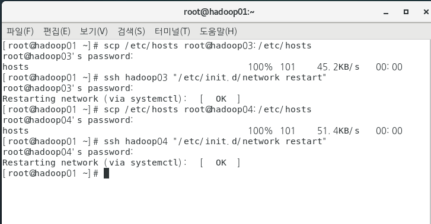

- 암호화된 통신을 위해서 공개키생성 후 배포

  사진이 암호화인듯

  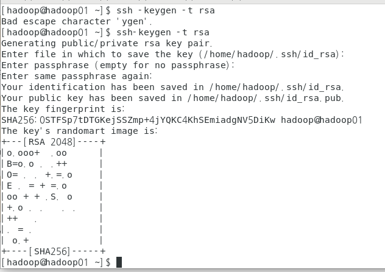

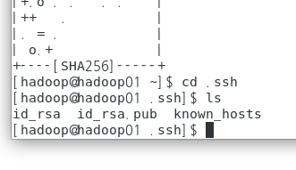

​								pub 붙어있는게 공개키

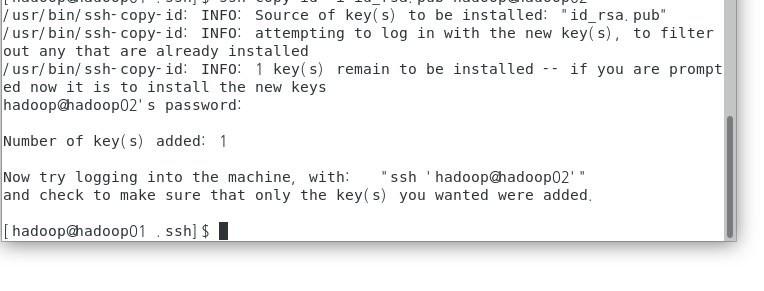

-----

#### 번외

etc의 hosts 파일을 이런식으로 입력하고

이렇게 입력하면 ssh hadoop2로 입력하면 접속할수 있다

#### 파일설치

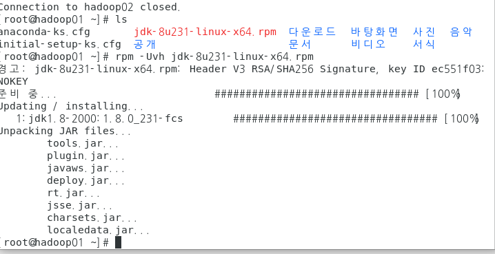

### 파일 복사인듯

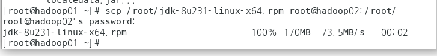

#### 파일설치

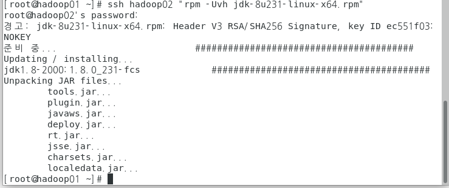

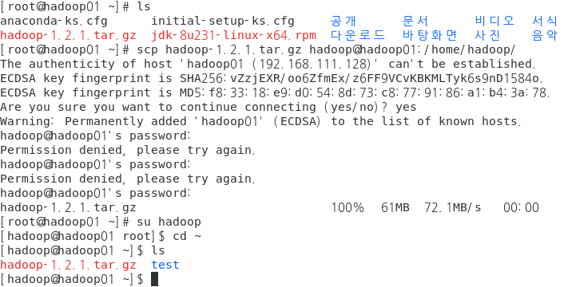

#### 압축풀기

tar -zxvf hadoop-1.2.1.tar.gz

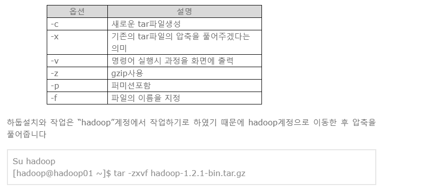

####  다른 hadoop에도 하둡파일 복사

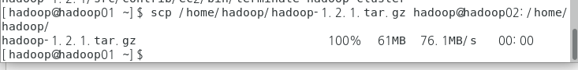

### 원격 압축해제

------

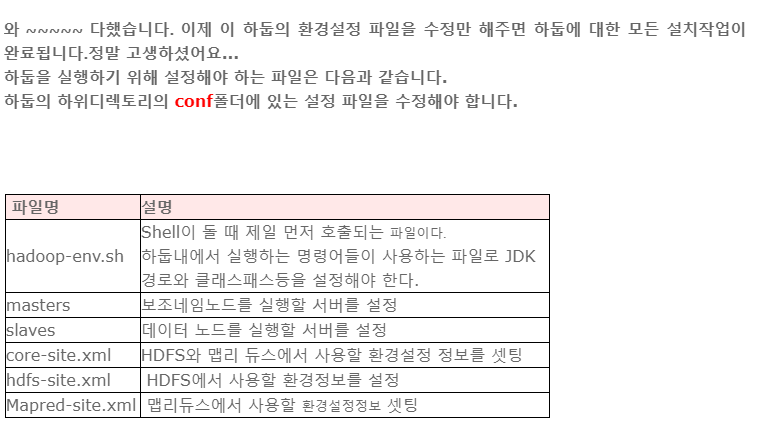

#### hadoop-env.sh

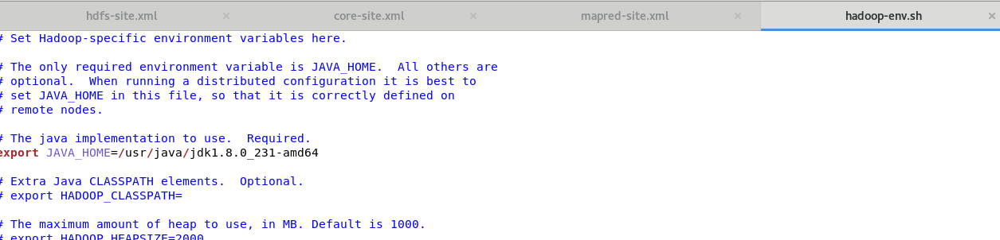

#### master

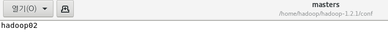

### slaves 

일을 처리하고 ~~

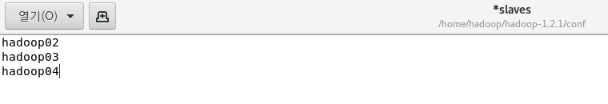

아이피 등록했기때문에 저렇게 적어도 된대

#### 임시 디렉토리 만들기

mkdir hadoop-data

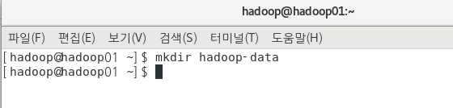

#### core-site.xml

임시로 사용한 폴더 경로와 내 네임로드에 대한 정보 명시

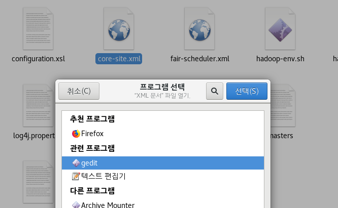

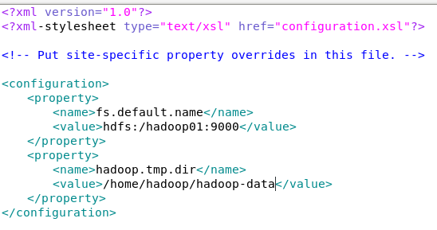

 **fs.default.name** : **HDFS****의 기본이름을 의미하며 위와 같이 작성합**

​                **니****다. 데이터노드들이 참조하기 위해 반드시 정의**

​                **해야** **합니다.**

​                **또한 마스터노드를 외부에서 찾아들어올 때 사용**

​                **할** **port를 지정합니다.**

​			

  **hadoop.tmp.dir** : **하둡에서 발생하는 임시 데이터를 저장하기 위한**

​               **공****간으로 지정하지 않으면 임시폴더인 tmp로 간**

​               **다. 그****런데 이 내용은 OS가 내려갔다 올라오면 날**

​               **라간다.**

***\*[출처]\** [[하둡설치하기\]하둡설정파일 등록하기](https://blog.naver.com/heaves1/220511959084)|\**작성자\** [heaves1](https://blog.naver.com/heaves1)**

### hdfs-site.xml

복제개수와 네임로드와 보조네일로드에 대한경로

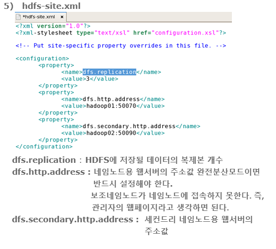

#### mapred-site.xml

##### job track에 대한 정보 (일을 처리하는?)

#### 파일전체 복사하기

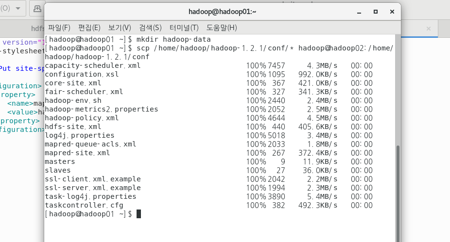

#### 하둡시작

home/hadoop/hadoop-1.2.1/bin/start-all.sh

 하둡끄기

/home/hadoop/hadoop-1.2.1/bin/stop-all.sh 

### wordcount사용하기 인듯

./bin/hadoop jar hadoop-examples-1.2.1.jar wordcount /input/README.txt /output

jar을 이용해서  hadoop-examples-1.2.1.jar의 wordcount사용하는건데 /input을 통해서 어떤 파일을 읽을것인지 정하고 /output어디로 할건지 정한다(뒤에 안적은건 그냥 결과를 여기서 띄우기 위함인듯)

