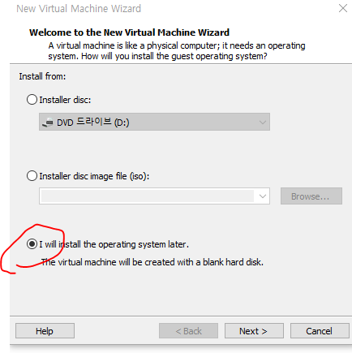
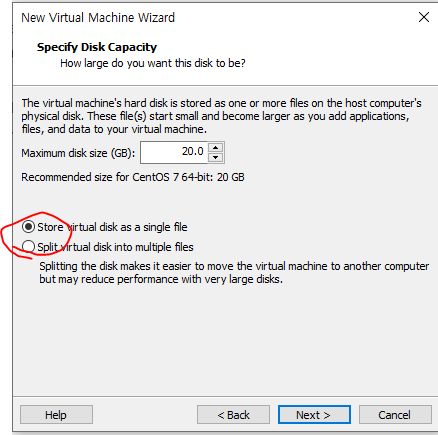
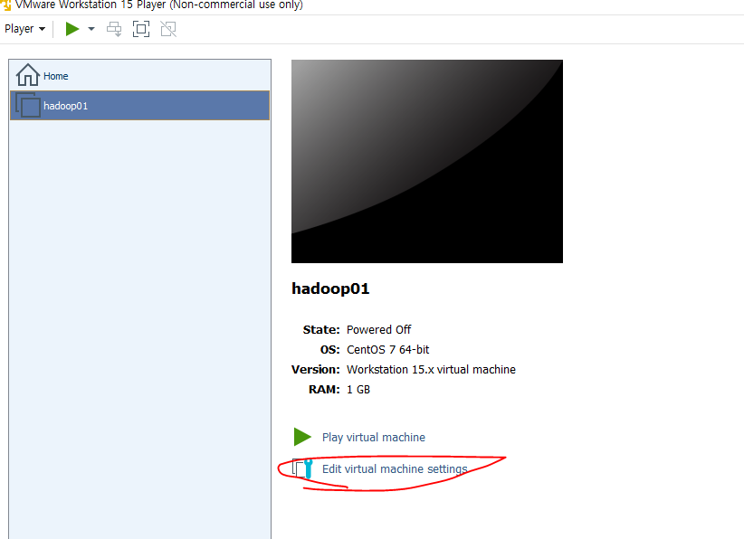
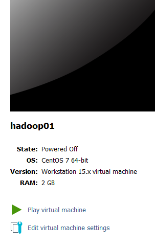
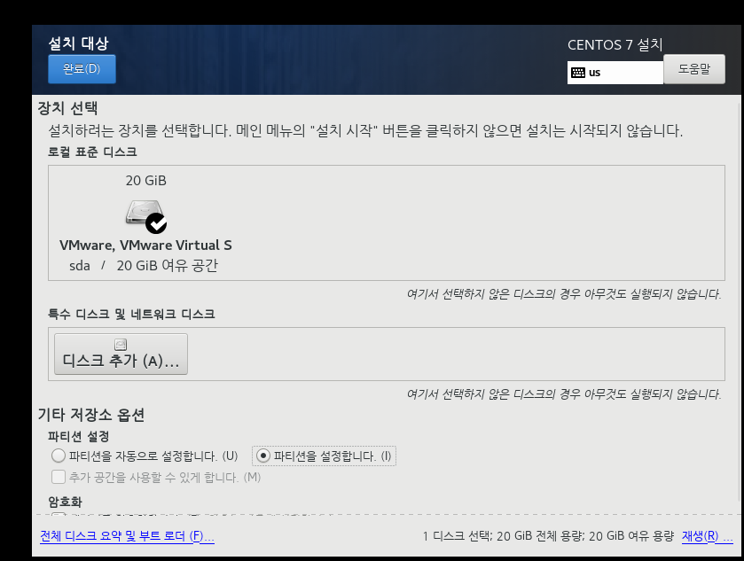
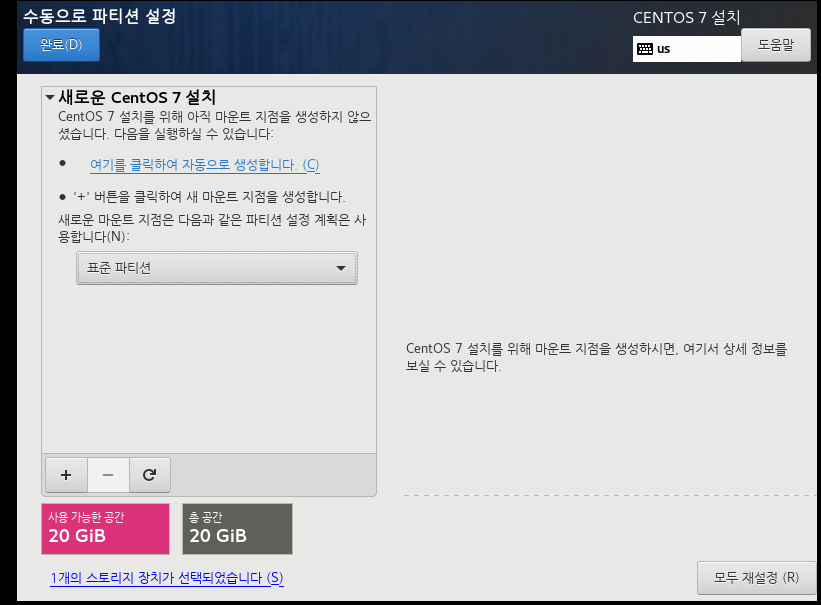
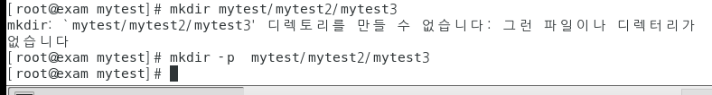
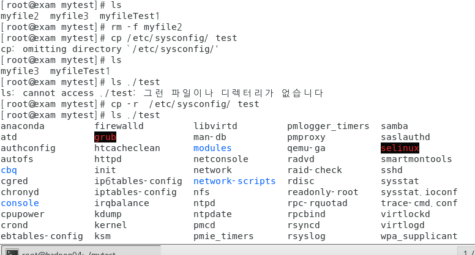

2020-02-11 리눅스 시작!

centos가 용량이 커서 먼저 다운

centos linux DVD ISO를 클릭할때는 최신버전 받을때임

전 버전을 받기 위해서 내린다음 older version 클릭 

7버전 받았습니다.

[CentOS-7-x86_64-DVD-1908.iso](http://mirror.kakao.com/centos/7.7.1908/isos/x86_64/CentOS-7-x86_64-DVD-1908.iso)

이거 받았음(영어경로에 받자)

------

그리고 vmware

무료다운로드의 [Workstation Player](https://www.vmware.com/kr/products/workstation-player/workstation-player-evaluation.html)

Window용 workstation

------

그리고 Securacle ( 가상화 )

가끔 안되는 경우가 있는데 씨모스에서 가상머신 가능하게 설정해야함

카페에서 pro.zip파일 받았음

--------

vmnetcfg

카페에서 vmnetcfg.zip파일 받았음

----------

pro.zip에 있는 파일은 가상화 가능한지 판단해주는 프로그램

vmware설치한다 -> enhanced 뭐라고 되있는거는 체크 안해도 되는데 그냥 체크했어

시작할때 업데이트 할건지 하는건 체크해제했음(둘다 체크해제)

------

vmware 실행 후

player-file-new virtual machine클릭

그 후 나중에 추가하겠다는 세번째 체크

Linux선택 후 - version은 centOS 7 64-bit 선택

경로 선택후 다음 next

하고 하나의 파일로 선택하는 첫번째 선택

custimize hardware는 나중에 바꿀수있기에 finish

-------

edit virtual machine settings 클릭

----

(하둡은?) 마스터 슬래이브 구조인데 마스터 역할을 하는것을 hadoop01로 할 예정

메모리를 2GB로 할거야 (드래그해서 2GB)

p` lay 누르고 팝업창 x 

 

-------------

p68 부분에 아이피 변경하는 부분이 있는데 무료 버전은 안되서 강사님이 주신 파일 vmnetcfg파일을 

C:\Program Files (x86)\VMware\VMware Player

복사하여 실행한다.  vmnet8부분 클릭후 setting하여 아이피 변경 

CENTOS설치할때 소프트웨어 선택에서  개발 및 창조를 위한 워크스테이션

파티션 할때 그림 더블클릭이 아니라 그냥 클릭 두번해서 파란색과 체크 동시에 뜨도록

파티션을 설정합니다.

-----

설정 과정은 강사님이 올려주신대

------

root => 프롬프트 #  

일반계정 => 프롬프트 $

~ => 홈디렉토리를 의미

Home(홈디렉토리) : 특정 계정으로 로그인 했을 때 자동으로 위치하는 폴더

​									모든 계정은 홈디렉토리를 갖고 있다.

​									기본설정은 홈디렉토리명이 계정명과 동일

​									root의 홈디렉토리명 tooy폴더

pwd 현재 작업장소(?)

---

#### 하위 폴더 만들기

#### ??

### ??

