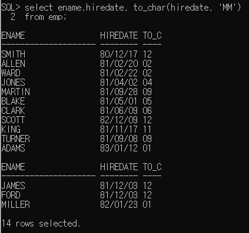

1. Query - 기본 select

   select 컴럼명1, 컬럼2.....

   from 테이블

   * sql문은 대소문자 구분하지 않는다.

   - ;은 sql문의 종료를 의미

   - ;을 입력하기 전에 여러 줄로 sql문을 작성할 수 있다.

   - *은 모든 컬럼을 조회하겠다는 의미

   - 컬럼에 null을 저장할 수 있다.

     null은 0이나 space만 입력해 놓은 값과 다른 값

     null은 아무값도 없는 것을 의미

     사용할 수 없고 자장되어 있지 않은 상태

2.  컬럼명 대신 alias를 정의해서 사용할 수 있다.

   select 컬럼명 alias명, 컬럼명 as alias명, 컬럼명 "alias명"

   ​                                                                           ↑ alias명에 공백이 있는경우

3.  여러 컬럼을 합쳐서 하나의 컬럼으로 조회할 수 있다.

    || 연산자 이용

   

4. 오라클의 문자열,날짜 데이터는 ' '(작은따옴표) 로 표현

5. 연산의 결과로 컬럼을 생성할 수 있다.

   (+,',/,.,함수...)  단, null이 포함되어 있는 컬럼은 연산할 수 없다.

6. 중복이 있는 경우 select문에 distinct를 추가할 수 있다.

7. select절에 조건 추가하기

   select[distinct] 컬럼명, 컬럼명,,,,,,[alias명]

   from 테이블명

   where 조건

   -검색 결과를 제한(조건에 만족하는 데이터만 조회하겠다는 의미)

   -where절은 from절 다음에 정의

   -where절은 조건식이 true가 되도록 정의

   -where절에 사용할 수 잇는 비교연산자

   	>,>=,<,<=,=,<>,!=
   	>
   	>

   -where절에서 조건과 함께 비교하는 값을 추가해야 하는 경우

    문자,날짜는 작은따옴표로 묶어주어야 한다.

   

   -SQL은 대소문자를 구분하지 않는다, 값을 비교하는 경우 정확하게 대소문자까지 일치

     

   -두 개 이상의 조건이 있는 경우 사용할 수 있는 연산자

      and연산자: 모든 조건이 일치

      or 연산자: 모든 조건 중 한 개만 일치(조건이 모두 다른 컬럼인 경우)

      between A and B : and연산과 동일

   ​									같은 컬럼에서 조건을 비교하는 경우

   

      in 연산자:or연산자의 의미와 동일

   ​					컬럼명 in (비교할값,값.....)

   ​					같은 컬럼에서 값을 여러 개 비교해야 하는 경우

      not연산자: 부정

   

 * null값에 대한 비교

   is null : null인 데이터를 조회

   is not null : null이 아닌 데이터를 조회

   

   

* like연산자 : 대표문자와 함께 사용

  ​                     조건 비교를 위해 입력한 값이 문자열에 포함되어 있는 것을 찾는 경우

  						* % : 모든 문자열
  						* _ : 한 자리 문자를 의미

  

  

  * 두 번째가 A인 단어

    

* 데이터 정렬

  * select [distinct] 컬럼명, 컬럼명.....[alias명]

  * from 테이블명

  * where 조건

  * order by 컬럼명 정렬기준

    ​                             → asc, sesc

    * asc: 오름차순정렬
    * desc: 내림차순정렬
    * 정렬기준을 생략하면 기본은 오름차순
    * 
    * 
    * 

    

* 함수

  * 함수의 종류는 단일행함수, 그룹함수가 있다.

  * 단일행함수를 정의하면 테이블의 모든 행에 각각 함수가 적용된다.

  * 그룹함수는 그룹으로 묶인 데이터에 적용되므로 where절에 그룹함수를 사용할 수 없다.

    * 단일행 함수

      select, where, order by절에 모두 사용할 수 있다.

      * 문자함수

        lower(문자열 or 컬럼명) : 값을 소문자로 변환

        upper(문자열 or 컬럼명) : 값을 대문자로 변환

        initcap(문자열 or 컬럼명) : 전달된 값의 첫 글자만 대문자로 변환

        

        substr(문자열 or 컬럼명, 시작위치, 문자열의 갯수)

        

        

        length(문자열 or 컬럼명) : 문자열의 길이름 반환

        

        instr(문자열 or 컬럼명, 찾을 문자, 찾을 위치, n번째 문자) : 특정 컬럼이나 문자열에서 문자의 위치를 찾을때 사용하는 함수

        - 찾을 위치나 n번째 문자에 대한 매개변수는 생략이 가능

        - 찾을 위치를 -1로 정의하면 문자열의 오른쪽 끝에서 문자를 찾는다.

        - select intr('oracle oracle oracle','a',5,2) from dual

          => 해당 문자열의 5번 위치부터 a를 찾아 위치를 반환 단,2번째 a위치를 반환

        - a 찾는데 첫번째꺼 a

        

        ​	a찾는데 5번째부터 찾는다

        

        a 찾는데 5번째 부터해서 2번째 a찾기

        

        -1 부터 하면 끝에서부터 찾는다

        

      concat(문자열 or 컬럼명,문자열 or 컬럼명): || 연산자와 동일, 문자열 연결

      

      LPAD(문자열 or 컬럼명, 출력할 문자열의 길이, 출력할 문자) : 전체 출력할 

      ​		문자열의 길이에 문자열을 출력한 후 남는 공간에 정의한 문자를 채워

      ​		출력해주는 함수(왼쪽)

      RPAD(문자열 or 컬럼명, 출력할 문자열의 길이, 출력할 문자) : 전체 출력할 

      ​		문자열의 길이에 문자열을 출력한 후 남는 공간에 정의한 문자를 채워

      ​		출력해주는 함수(오른쪽)

      

      ltrim(문자열 or 컬럼명, 제거할 문자) : 컬럼에서 매개변수로 정의한 문자를

      ​		왼쪽에서 찾아 모두 제거

      rtrim(문자열 or 컬럼명, 제거할 문자) : 컬럼에서 매개변수로 정의한 문자를

      ​		왼쪽에서 찾아 모두 제거

      ​       (둘다 주로 공백을 지울때 사용)

      

    * 숫자함수

      - round(숫자, 반올림할 위치) : 반올림

        

        

    * 변환함수

      * 데이터의 타입을 변환하기 위한 함수

      * 또 다른 함수의 매개변수로 사용하게 될 경우 타입이 컬럼의 타입과 일치해야 하므로

      * cast(값 or 컬럼명 as 타입)

         									=>  날짜: date

        ​											숫자: integer

        

      * to_char(변환할데이터, 표시할format)

        * 숫자를 문자로 반환 : 세 자리마다 , 를 출력하고 싶은 경우

          숫자의 한 자리를 표시 => 9, 0

          콤마 => ,

          소수점 => .

          통화기호 => \,$,L( 지역의 통화기호를 출력 )

          

          

        * 날짜를 문자열로 변환 : 년 월 일 각각의 데이터를 추출하고 싶은 경우

          년도 => YYYY(2019)

          월 => MM(12)

          일 => DD(19)

          

          

        * 날짜함수

           sysdate  => 이것도 연산가능 ex)sysdate+5

          

        * null처리 함수

          * nvl(컬럼, null인 경우 처리할 식이나 값) - null인 경우 대신할 식이나 값을 명시

          * nvl2(컬럼,            표현값1,               표현값2)

             	                =>null이 아닌경우          =>null인 경우

            

            

            

            

  * 그룹함수
    - group by를 적용한 후에 사용할 함수
    - sum,avg,max,min,count 등
    - 
    - 

* 세션 언어정보 바꾸기

* 몇명인지 카운트 하려면 기본값을 사용하는 것이 좋다 (primary key인듯)

  

  

  

  

  

  

  

  

  

  

  

  

  * hr 계정의 비번을 hr로 바꿈

  

  

