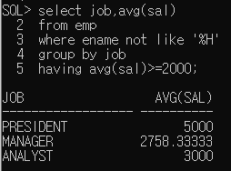
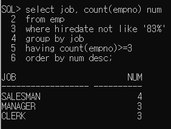

## 2. 그룹화

​	select 컬럼...

​	from 테이블...

​	where 조건

​	group by 그룹화할 컬럼명(함수를 포함한 식도 가능)

​	having group by한 결과에 적용할 조건	

​	order by 정렬할 컬럼명

* 테이블에 저장된 레코드를 그룹화 하여 분류하고 싶은 경우 사용
* select절에는 group by절에 명시한 컬럼명과 그룹함수만 사용할 수 있다.
* 데이터가 복잡한 경우 group by절에 두 개 이상의 컬럼을 명시할 수 있다.
* 
* 

* group by하기 전에 적용해야 하는 조건은 where절에 정의

* group by한 결과에 조건을 적용해야 하는 경우 having절을 이용

   														조건에 그룹함수를 써야하면 having에 추가

