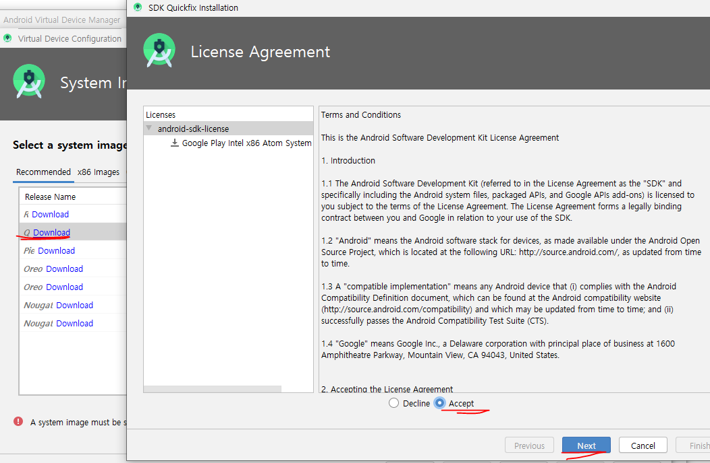
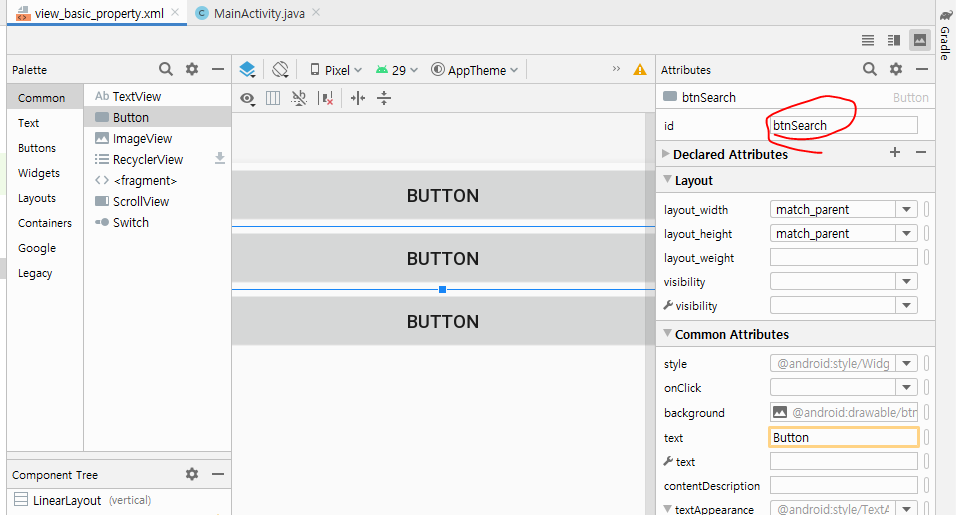

## 안드로이드

---------

```java
//android 시작
```


### 설치


다운 파일을 c:\iot\setup으로 옮기자 ( 영어 경로로 해야하기때문 )


가상으로 테스트할수 있는 도구(AVD라고 지칭할 예정) default값으로 계속간다.


설치 끝나면





x누르고  확인해보면


nexus(설정한 디바이스)가 있다.


확인한다.


### activity_main.xml

```java
<?xml version="1.0" encoding="utf-8"?>
<androidx.constraintlayout.widget.ConstraintLayout  //외부라이브러리 우리가 할때는 바꿀거야  xmlns:android="http://schemas.android.com/apk/res/android"
    xmlns:app="http://schemas.android.com/apk/res-auto"
    xmlns:tools="http://schemas.android.com/tools"
    android:layout_width="match_parent" 
    android:layout_height="match_parent"
    tools:context=".MainActivity">

    <TextView
        android:layout_width="wrap_content"
        android:layout_height="wrap_content"
        android:text="Hello World!"
        app:layout_constraintBottom_toBottomOf="parent"
        app:layout_constraintLeft_toLeftOf="parent"
        app:layout_constraintRight_toRightOf="parent"
        app:layout_constraintTop_toTopOf="parent" />

</androidx.constraintlayout.widget.ConstraintLayout>
```


이렇게 바꾼다.

```java
<?xml version="1.0" encoding="utf-8"?>
<LinearLayout  								//수정한것 (우리가 흔히 만드는 비지니스앱은 Linear로도 충분하다)
    xmlns:android="http://schemas.android.com/apk/res/android"
    xmlns:app="http://schemas.android.com/apk/res-auto"
    xmlns:tools="http://schemas.android.com/tools" // 디바이스에는 전달 안되는 속성
    android:layout_width="match_parent"	// android : 실제 속성 등을 주는 접두사
    android:layout_height="match_parent"  // "match_parent" 폰사이즈에 꽉차게 채우겠다.
    tools:context=".MainActivity">

    <TextView			
        android:layout_width="wrap_content"  //"wrap_content"자기의 원래 사이즈 
        android:layout_height="wrap_content"
        android:text="Hello World!"
        app:layout_constraintBottom_toBottomOf="parent"
        app:layout_constraintLeft_toLeftOf="parent"
        app:layout_constraintRight_toRightOf="parent"
        app:layout_constraintTop_toTopOf="parent" />

</LinearLayout>
```


```java
<?xml version="1.0" encoding="utf-8"?>
<LinearLayout xmlns:android="http://schemas.android.com/apk/res/android"
    xmlns:app="http://schemas.android.com/apk/res-auto"
    xmlns:tools="http://schemas.android.com/tools"
    android:layout_width="match_parent"
    android:layout_height="match_parent"
    android:orientation="vertical"	//추가 시킨다.
    tools:context=".MainActivity">

    <Button
        android:id="@+id/button"
        android:layout_width="wrap_content"
        android:layout_height="wrap_content"
        android:layout_weight="1" 	//일단 지운다
        android:text="Button" />

    <Button
        android:id="@+id/button2"
        android:layout_width="wrap_content"
        android:layout_height="wrap_content"
        android:layout_weight="1" //일단 지운다
        android:text="Button" />

    <Button
        android:id="@+id/button3"
        android:layout_width="wrap_content"
        android:layout_height="wrap_content"
        android:layout_weight="1" //일단 지운다
        android:text="Button" />
</LinearLayout>
```


확인해보면 


그 후 버튼을 match_parent로 바꾸면

```java
<?xml version="1.0" encoding="utf-8"?>
<LinearLayout xmlns:android="http://schemas.android.com/apk/res/android"
    xmlns:app="http://schemas.android.com/apk/res-auto"
    xmlns:tools="http://schemas.android.com/tools"
    android:layout_width="match_parent"
    android:layout_height="match_parent"
    android:orientation="vertical"
    tools:context=".MainActivity">

    <Button
        android:id="@+id/button"
        android:layout_width="match_parent"
        android:layout_height="match_parent"

        android:text="Button" />

    <Button
        android:id="@+id/button2"
        android:layout_width="match_parent"
        android:layout_height="match_parent"

        android:text="Button" />

    <Button
        android:id="@+id/button3"
        android:layout_width="match_parent"
        android:layout_height="match_parent"

        android:text="Button" />
</LinearLayout>
```


버튼 세개가 합쳐져서 하나로 보인다


아래처럼 바꾼다.


### 코드 설명(위에 사진들)

layout_width : view의 너비

layout_height : view의 높이

orientation : 배치방향

id : 각 위젯을 식별할 수 있는 이름

​		btn

​		txt

margin : 주위여백

padding : 내부컨텐츠와 boarder사이의 간격

layout_weight : 여백을 해당 view의 사이즈로 포함

layout_gravity : parent내부에서 view의 정렬

gravity : view내부에서의 정렬


#### id 확인




200은 오류 뜨는데 단위가 없어서 그런다 dp를 사용한다.


#### l


### AndroidMainifest.xml 

```java
<?xml version="1.0" encoding="utf-8"?>
<manifest xmlns:android="http://schemas.android.com/apk/res/android"
    package="exam.day02.view.layout">

    <application
        android:allowBackup="true"
        android:icon="@mipmap/ic_launcher"
        android:label="@string/app_name"
        android:roundIcon="@mipmap/ic_launcher_round"
        android:supportsRtl="true"
        android:theme="@style/AppTheme">
        <activity android:name=".MainActivity"> // 액티비티에서 가장 먼저 실행될 액티비티부분
            <intent-filter>
                <action android:name="android.intent.action.MAIN" />//
										// 위아래 두개 없으면 첫번째 실행하는거 아니야
                <category android:name="android.intent.category.LAUNCHER" />//
            </intent-filter>
        </activity>
    </application>

</manifest>
```


#### 사용자 정의 Adapter만들기

* 안드로이드에서 앱을 구성할 때 목록형식을 가장 많이 사용
* 사용자정의로 디자인한 뷰를 목록으로 사용하고 싶은 경우
* 안드로이드 내부에서 제공하는 Adapter로 표현하고 싶은 내용을 모두 표현할 수 없다.(이벤트연결, 각 목록의 구성을 다르게 생성...)


[구성요소]

- Adapter를 이용해서  출력할 데이터를 저장하는 객체(DTO)

- 사용자정의 Adapter

  1) 안드로이드에서 제공하는 Adapter클래스를 상속

  * 리스트뷰를 만들때 필요한 정보를 저장할 수 있도록 멤버변수 정의(Context, row디자인 리소스,데이터)

  2) 생성자 정의

  	* 상속받고 있는 ArrayAdapter의 생성자 호출

  3) ArrayAdapter에 정의되어 있는 메소드를 오버라이딩

   * getView : 리스트뷰의 한 항목이 만들어질때마다 호출

     ​				=> 전달된 리소스를 이용해서 뷰를 생성(LayoutInflator)

     ​				=> 한 row를 구성하는 뷰를 찾아서 데이터와 연결

  4) getView메소드에서 성능개선을 위한 코드를 작성

  * 한 번 생선한 view를 재사용
  * findViewById는 한 번만 찾아오기

  5) ViewHolder객체를 생성

  * row를 구성하는 뷰를 한 번 findViewById하기
  * row에 대한 구성 View를 멤버변수로 선언
  * 생성자에서 findViewById처리를 구현
  * 최초로 뷰를 만들때(row에 대한 뷰) 이 객체를 활용

  6) row를 구성하는 뷰에 상태값을 저장하기

  * 각 뷰의 이벤트를 통해 저장

  * 각 뷰의 상태값을 저장할 수 있도록 객체

    : 상태값을 저장한 객체를 자료 구조에 저장

       focus를 잃어버릴 때 상태를 저장

* Adapter를 통해 만들어진 리스트뷰를 보여줄 액티비티
  * main layout필요


## Intent

1. 인텐트 객체를 생성하고 실행할 액티비티의 정보와 데이터를 셋팅

   * 값

     putExtra메소드를 이용

   * 객체

2. 안드로이드OS에 인텐트 객체 넘기며 의뢰

   액티비티실행

   startActivity

3. 인텐트에 설정되어 있는 액티비티 호출

4. 호출된 액티비티에서는 안드로이드OS가 넘겨준 인텐트를 가져오기