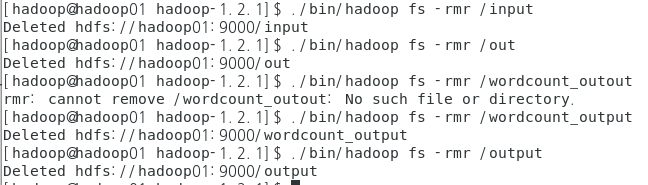
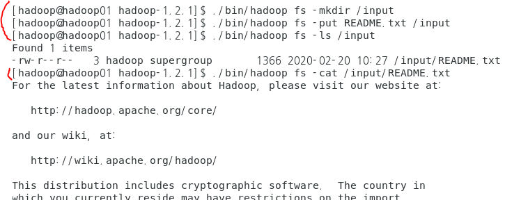

## HDFS(하둡 분산파일 시스템)

### hdfs 초반

#### * outputStream

```java
package hdfs.exam;

import java.io.IOException;

import org.apache.hadoop.conf.Configuration;
import org.apache.hadoop.fs.FSDataInputStream;
import org.apache.hadoop.fs.FSDataOutputStream;
import org.apache.hadoop.fs.FileSystem;
import org.apache.hadoop.fs.Path;

/*
 * hadoop의 hdfs를 api로 제어
 * 	- hadoop hdfs에 api를 이용해서 파일을 생성
 * 	- 사용자가 지정하는 경로에 파일 생성
 */
public class HDFSExam01 {

	public static void main(String[] args) {
		//1. hdfs를 제어하기 위해서 설정 파일을 읽어서 사용해야 하므로
		// hadoop 설치 폴더의 설정 파일을 접근하기 위해
		// 제공되는 클래스
		Configuration conf = new Configuration();
		
		//2. HDFS를 접근하기 위해서 제공되는 객체 생성 - HDFS객체
		FileSystem hdfs = null;
		//3. HDFS에 output하기 위한 스트링객체
		FSDataOutputStream hdfsout = null; // FileWriter fw=null처럼 정의하는 것과 동일
		try {
			hdfs = FileSystem.get(conf);
			
			//4. HDFS의 경로를 표현할 수 있는 객체
			// => HDFS에 출력할 파일의 경로를 명령행매개변수로
			//	    받아서 적용하겟다는 의미
			Path path = new Path(args[0]);
			
			//5. HDFS에 저장하기 위해 output스트림 생성하기
			hdfsout = hdfs.create(path);
			//6. 출력스트림에 데이터를 출력하여 HDFS에 저장
			//	  => 명령형 매개변수로 입력한 내용을 파일에 쓰겠다는 의미
			hdfsout.writeUTF(args[1]);
		} catch (IOException e) {
			
			e.printStackTrace();
		}
	}

}

```


* 하둡에서 실행할때

./hadoop-1.2.1/bin/hadoop jar multi-hadoop-examples.jar hdfs.exam.HDFSExam01 output.txt hellohadoop


#### * inputStream

```java
package hdfs.exam;

import java.io.IOException;

import org.apache.hadoop.conf.Configuration;
import org.apache.hadoop.fs.FSDataInputStream;
import org.apache.hadoop.fs.FSDataOutputStream;
import org.apache.hadoop.fs.FileSystem;
import org.apache.hadoop.fs.Path;

/*
 * hadoop의 hdfs를 api로 제어
 * 	- hadoop hdfs에 api를 이용해서 저장된 파일을 읽어서 콘솔에 출력하기
 */
public class HDFSExam02 {

	public static void main(String[] args) {
		//1. hdfs를 제어하기 위해서 설정 파일을 읽어서 사용해야 하므로
		// hadoop 설치 폴더의 설정 파일을 접근하기 위해
		// 제공되는 클래스
		Configuration conf = new Configuration();
		
		//2. HDFS를 접근하기 위해서 제공되는 객체 생성 - HDFS객체
		FileSystem hdfs = null;
		//3. HDFS에 input하기 위한 스트링객체
		FSDataInputStream hdfsin = null; // FileWriter fw=null처럼 정의하는 것과 동일
		try {
			hdfs = FileSystem.get(conf);
			
			//4. HDFS의 경로를 표현할 수 있는 객체
			// => HDFS에 읽을 파일의 경로를 명령행매개변수로
			//	    받아서 적용하겠다는 의미
			Path path = new Path(args[0]);
			
			//5. HDFS에 저장된 파일을 읽어야 하므로 스트림 생성하기
			hdfsin = hdfs.open(path);
			// 6. 입력스트림을 통해 데이터를 읽는다.
			String data= hdfsin.readUTF();
			System.out.println("hdfs에서 읽은 데이터:"+data);
		} catch (IOException e) {
			
			e.printStackTrace();
		}
	}

}
```

* 하둡에서 실행할때

./hadoop-1.2.1/bin/hadoop jar multi-hadoop-examples.jar hdfs.exam.HDFSExam01 output.txt 


#### * output input Stream 둘다 적용 원래 있던거 복사해서 그대로 만들기

```java
package hdfs.exam;

import java.io.IOException;

import org.apache.hadoop.conf.Configuration;
import org.apache.hadoop.fs.FSDataInputStream;
import org.apache.hadoop.fs.FSDataOutputStream;
import org.apache.hadoop.fs.FileSystem;
import org.apache.hadoop.fs.Path;

public class HDFSCopyTest {

	public static void main(String[] args) {
	Configuration conf = new Configuration();
		
		FileSystem hdfs= null;
		
		FSDataInputStream hdfsinput=null;
		FSDataOutputStream hdfsout = null;
		
		try {
			hdfs=FileSystem.get(conf);
			
			Path path = new Path(args[0]);
			
			hdfsinput=hdfs.open(path);
			
			String inputString=hdfsinput.readUTF();// 여기가 output.txt의 hellohadoop 읽는거
			
			//System.out.println(inputString);
			
			Path path1 = new Path(args[1]);
			hdfsout = hdfs.create(path1);
			
			hdfsout.writeUTF(inputString);
			
		} catch (IOException e) {
			// TODO Auto-generated catch block
			e.printStackTrace();
		}
		
}
}
```


* 하둡에서 실행할때

./hadoop-1.2.1/bin/hadoop jar multi-hadoop-examples.jar  hdfs.exam.HDFSCopyTest output.txt output1.txt


----

----

#### rmr

- hdfs 상의 폴더 지울때 사용
- 

#### etc

```
/home/hadoop/hadoop-1.2.1/bin/hadoop fs -copyFromLocal NOTICE.txt /input
```

- 

#### 폴더 만들고 README.txt 옮기고 확인하고 내용확인




#### MultipleOutputs

​	=> 한 개의 입력데이터를 이용해서 여러 개의 output을 만들고 싶은 경우 사용


  * Mapper : GenericOptionParser작업할 때와 동일하게 map메소드를 구성하며 보통 구분할 수 있도록 key key에 각 상황별로 문자열만 추가해준다.

  * Reducer : Mapper에서 넘겨준 데이터서 구분자를 기준으로 분리해서 합산 - 개별 output이 생성될 수 있도록 처리

      * setup : Reducer객체가 처음 실행될 때 한 번 호출되는 메소드

        ​			MultipleOutputs객체를 생성

      * reduce : 각각의 상황별로 write가 호출될 수 있도록 처리

        ​				(up, eqal, down)

      * clenanUp : Reducer의 작업이 종료될 때 한 번 호출 되는 메소드

        ​					MultipleOutPuts 객체를 해제(반드시 처리)

* Driver : MultipleOutputs로 출력될 경로를 Path에 설정 prefix로 구분문자열을 정의