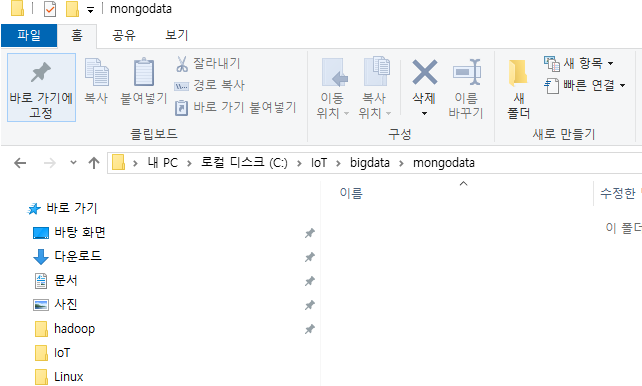

## MONGODB(몽고디비)

#### 다운받고 설치한다

사진에는 3.4.24버전이지만 3.6.17버전으로 한다

설치파일 실행 ( COMPLETE )

다운되면 그냥 끈다

#### 경로 복사해서 PATH설정

cmd에서 mongd

하지막 failure 떴는데  데이터(하둡으로 치면 하둡데이터)가 저장될 폴더가 필요

폴더를 만든다

그리고 명령어 실행할때 설정까지같이(원래 이렇게 안하고 기본으로 설정할수 있지만 우리는 안한다)

그러면 커서만 깜빡거리는 화면(서버기 때문이야)

cmd창 추가로 하나 더 열고 그냥 mongo를 입력하면

일단 뭐가 실행됐다고만 알아라

또 cmd로 mongo 입력하면 또 뜨는데 이는 다중접속이 된다는 것을 의미한다.

서버 띄운것을 확인하면 떴다는 것을 확인할 수 있다.

브라우저 실행하고 127.0.0.1:27017 실행하면( port 확인해서 숫자가 다를 수 있음 )

ctrl+C로 하나는 종료 시킨다

##### 기타설정은 아래 사이트 참조

https://docs.mongodb.com/v3.6/introduction/

### <<용어>>

collection : 테이블

document : 레코드

field : 컬럼

_id : 기본키

#### 다음 과정

use mydb => 내가 사용할 db로 접속

역시 아무 것도 안뜬다. 내 mydb안에 아무것도 안넣었기때문에 아무것도 안나오는것이다.

상태를 확인하면 그렇다

#### db에서 나온다

데이터베이스를 만들고(use mydb가 오라클의 conn) 그후 컬렉션을 만들고

(admin,config,local은 시스템 계정 같은거 인듯)

### 순서

#### 1. collection

1. collenction(rdbms에서 테이블)

   => 관계형 데이터베이스처럼 스키마를 정의하지 않는다.  (스키마 : 타입같은거)

   1) 종류

    * capped collection

      : 고정사이즈 주고 생성하는 컬렉션

      미리 지정한 저장공간이 모두 사용이 되면

      맨 처음에 저장된 데이터가 삭제되고 공간으로 활용

    *  non capped collection

      : 일반적인 컬렉션

   2) collection관리

   ​	[생성]

   ​	db.createCollection("컬렉션명")    => 일반 collection

   ​	db.createCollection("컬렉션명",{옵션list})    => 각각의 옵션을 설정해서 작업(json)

   ​	[삭제]

   ​	db.collection명.drop()

   ​	[컬렉션명 변경]

   ​	db.컬렉션명.renameCollection("변경할컬렉션명");

   

   

   아래에 보면 실습했다

   

   

   

​		여기서 test 테이블명

확인해보면 

collection생성

drop하는법

rename

capped여부도 명령어로 확인할 수 있다.

#### 2. mongodb의 insert

	##### 	[구문]

​	db.컬렉션명.insert({데이터...})

​	db.컬렉션명.insertOne({데이터...})

​	db.컬렉션명.insertMany({데이터...})

 - document(관계형 db에서 레코드 개념)에 대한 정보는 json의 형식으로 작성

 - mongdb에서 document를 삽입하면 자동으로

   _id가 생성  => 기본키의 역할

    "_id" : ObjectId("5e6ee790590a77a83c5c3b98")             => 밑 그림 참고

   ​								\-----------------------------------------

   ​							현재timestamp + machine Id + mongodb프로세스id + 순차번호

   

위에 보면 사이즈가 다른데 스키마가 없기때문에 들어간다(비정형 데이터에 적합!)

save와 insert의 차이는 나중에

자바스크립트기 때문에 명령어도 가능

##### [] 은 json의 배열 표기방식

##### 한번에 insert

여기서 확인해보면 _id(기본키)도 바꿔서 설정할 수 있다. 그러나 미리 있는 기본키로 insert하려고 하면 안된다

##### 과제

**1. mongo1day라는 이름으로 DB를 작성하세요**

**2. customer라는 이름으로 collection을 작성하세요**

**3. customer라는 collection에는 다음과 같은 성격의 필드를**

**갖고 저장될 수 있도록 임의의 데이터를 입력합니다.**

**==> document 5섯개**

**id : 기본 아이디**

**pass: 패스워드**

**name : 성명**

**info:{**

​     **city :거주했던 지역**

​      **[배열로 관리 - 기본 세 개 정도 입력하기]**

​      **toeicjumsu: 토익점수**

​      **[]로 다섯 개 정도 입력**

**}**

**city는 자유롭게 입력하시고 토익점수에 대한 배열은 다음과 같습니다.**

**[700,800,650,850,855]**

**[555,780,650,900,855]**

**[480,540,656,770,820]**

**[450,500,558,850,950]**

**[700,800,860,870,890]**

#### 3. mongodb에update

 * document수정
 * 조건을 적용해서 수정하기 위한 코드도 json으로 구현

[update를 위한 명령어]

$set: 해당필드의 값을 변경(업데이트를 하기 위한 명령어)

​			none capped collection인 경우 업데이트할 필드가 없는 경우 추가한다.

$inc:해당필의 저장된 숫자의 값을 증가

$unset : 원하는 필드를 삭제할 수 있다.

업데이트 옵션 : 

​			multi => true를 추가하지 않으면 조건에 만족하는 document중 첫 번째 document만 update

[구문]

db.컬렉션명.update({조건필드:값},	//sql의 update문 where절

​									 {$set:{수정할필드:수정값}},	//set절

​									 {update와 관련된 옵션:옵션값})

바뀐것 확인

3개를 넣었는데 1개만 변경된다( 맨 첫번째 ) 

그래서 옵션을 줘야한다.

이렇게 하면 kang의 val1이 모두 3000이 된다.

##### inc를 썼을때(증가)

​	

기존 3000에서 2000증가한 5000이 되었다

##### 컬렉션 따로 안만들어도 알아서 생성된다.

createCollection안했는데 score가 있음을 확인할수 있다.

##### $unset 하면 원하는 필드를 삭제할 수 있다. 

#### 4. mongodb에서 배열 관리

​	db.score.update({id:"jang"},{$set:{info:{city:["서울","안양"],movie:["겨울왕국2","극한직업","쉬리"]}}});

[배열에서 사용할 수 있는 명령어]

$addToSet

​	(없는 경우에만 값을 추가,중복을 체크)

​	db.score.update({id:"jang"},{$addToSet:{"info.city":"인천"}});

$push

배열의 요소를 추가

​	: 중복을 허용

​	db.score.update({id:"jang"},{$push:{"info.city":"천안"}})

$pop

​	배열에서 요소를 제거할 때 사용

​	1이면 마지막 요소를 제거,-1이면 첫 번째 요소를 제거

​	db.score.update({id:"jang"},{$pop:{"info.city":1}})

​	db.score.update({id:"jang"},{$pop:{"info.city":-1}})

$each : addToSet이나 push에서 사용할 수 있다.

​				여러 개를 배열에 추가할 때 사용

​	db.score.update({id:"jang"},{$push:{"info.city":{$each:["천안","가평","군산"]}}})

$sort : 정렬(1:오름차순,-1:내림차순)

db.score.update({id:"jang"},{$push:{"info.city":{$each:["천안","가평","군산"],$sort:1}}})

$pull : 배열에서 조건에 만족하는 요소를 제거(조건 한 개)

db.score.update({id:"jang"},{$pull:{"info.city":"천안"}})

$pullAll:배열에서 조건에 만족하는 요소를 제거(조건을 여러 개)

db.score.update({id:"jang"},{$pull:{"info.city":["가평","군산"]}})

중복의 유무

pop은 1을 넣으면 오른쪽 끝에서 지운다

-1을 넣으면 왼쪽 끝에서 지운다.

each는 여러개를 배열에 추가할때 쓴다.

pull 그냥 하면 안되는데

pullAll로 하면 지워진다.(pull은 조건하나 pullAll은 조건여러개)

