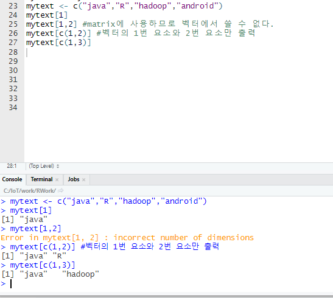

## R

이중 아무거나 클릭한다.

이후 윈도우용 클릭하면

install R for the first time 클릭해서

https://rstudio.com/

RStudio는 R을 훨씬 효과적으로 쓸수있게 하기 위해서 쓰는거

R은 컴퓨터이름,사용자이름,설치경로가 한글 안됨, 특수문자 안됨

경로를 영어경로로 옮긴후 설치경로를 program files의 가운데 띄어쓰기가 오류를 낼수 있으므로 영어경로로 설치한다

32bit는 필요 없으므로 체크해제

테스트 해본다

다음으로 RStudio도 R과 같은 경로에 설치한다.

RStudio를 항상 관리자 권한으로 실행되도록 설정한다.

