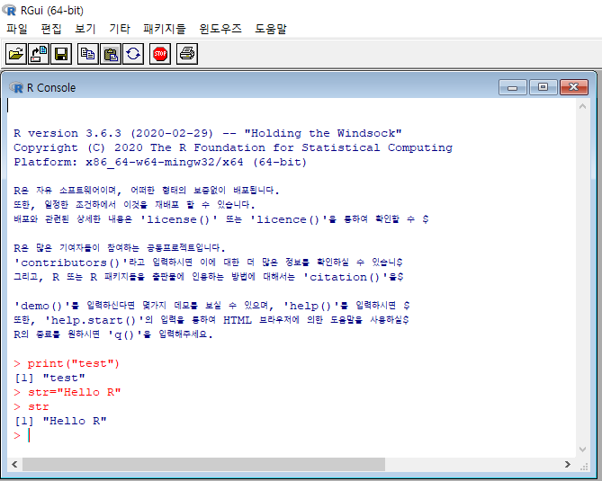

## R


이중 아무거나 클릭한다.


이후 윈도우용 클릭하면


install R for the first time 클릭해서


https://rstudio.com/


RStudio는 R을 훨씬 효과적으로 쓸수있게 하기 위해서 쓰는거


R은 컴퓨터이름,사용자이름,설치경로가 한글 안됨, 특수문자 안됨


경로를 영어경로로 옮긴후 설치경로를 program files의 가운데 띄어쓰기가 오류를 낼수 있으므로 영어경로로 설치한다


32bit는 필요 없으므로 체크해제


테스트 해본다




다음으로 RStudio도 R과 같은 경로에 설치한다.


RStudio를 항상 관리자 권한으로 실행되도록 설정한다.


여러 명령어 수업했다


----

라이브러리 다운받기


https://cran.r-project.org/


명령어로 라이브러리를 다운 받으면 된다.

```R
install.packages("beepr")
library("beepr")
beep()
for(i in 1:10){
  beep(sound=i)
  Sys.sleep(1) #프로세스를 1초동안 재우겠다.
                #1초동안 프로세스를 동작시키지 않겠다는 의미
  
  
}
```


#### 인코딩 배우기


```R
df <- data.frame(mydata=1:5,mydata2=letters[1:5],mydata3=c("이민호","android","@한글%$@","test","한글"))
df
####파일 write####
write.csv(df,"encoding_test.csv",row.names = FALSE)
write.csv(df,"encoding_test_euckr.csv",row.names = FALSE,fileEncoding = "euc-kr")
write.csv(df,"encoding_test_cp949.csv",row.names = FALSE,fileEncoding = "cp949") # 한글깨진다
write.csv(df,"encoding_test_utf8.csv",row.names = FALSE,fileEncoding = "utf8") 


####깨진파일 처리하기####
read.csv("encoding_test_utf8.csv")
readLines("encoding_test_utf8.csv")
readLines("encoding_test_utf8.csv",encoding = "UTF-8")

#data.table - dataframe보다 강력
install.packages("data.table")
library("data.table")

dftable <- fread("encoding_test_utf8.csv")
head(dftable)

#인코딩함수
Encoding(dftable$mydata3) = "UTF-8"
head(dftable)

```

#### ggplot2 (그래프 그리기)

```R
install.packages("ggplot2")
library("ggplot2")
mydata <- c("java","spring","bigdata","android")
qplot(mydata)
qplot(data=mpg,x=hwy)
qplot(data=mpg,x=hwy,y=drv)
qplot(data=mpg,x=drv,y=hwy,geom = "line")
qplot(data=mpg,x=drv,y=hwy,geom = "boxplot")
qplot(data=mpg,x=drv,y=hwy,geom = "boxplot",colour=drv)

```


#### 외부데이터 읽어오기

```R
####외부데이터 읽어오기####


####csv파일읽기####
#readLines을 이용하면 데이터가 커도 어떤 구성인지 확인하기 편하다
dfimport <- readLines("01_csv.csv",n=3)
dfimport
#csv파일이므로 ,로 구분이 되어 있지만 사용자가 원하는 구분자를 적용해서 작성한 문자열인 경우
#01_csv.csv읽은 내용을 가공해서 데이터프레임을 작성
dfcsv <- data.frame(num=1:3,mydata=dfimport,stringsAsFactors = FALSE)
dfcsv
dfcsv$mydata #컬럼안의 문자열이 ,가 추가
strsplit(dfcsv$mydata,split = ",")[[1]]
strsplit(dfcsv$mydata,split = ",")[[2]]

#하나의 컬럼안에 구분자로 텍스트가 구성된 경우 분리
install.packages("splitstackshape")
library("splitstackshape")
dfcsv2 <- cSplit(indt=dfcsv,splitCols = "mydata",sep=",")
dfcsv2
class(dfcsv2)
#타입 변경
#as의 함수들을 이용해서 변경 as는 ~~~가 아닌 것을 ~~~로 변경한다는 의미 
# - data.table과 data.frame의 속성을 가지고 있는 dfcsv2를 dataframe으로 변경
dfcsv2 <- as.data.frame(dfcsv2)
class(dfcsv2)
class(dfcsv2$num)
class(dfcsv2$mydata_1)
class(dfcsv2$mydata_2)
class("dd")
str(dfcsv2) #전체 데이터의 구조를 확인
#변환한 데이터들의 타입이 Factor
#Factor는 순서와 명목형
#1,2,3......의 값이 어떤 순서를 의미하는 경우 : 컬럼의 데이터가 순서형
#class컬럼 1,2,3,4....:순서를 의미하지 않고 1번,2번,3번...
#순서가 적용되도록 정의된 Factor타입을 char로 변경
#1번 컬럼을 뺀 나머지 컬럼의 타입을 char로 변환
for(i in 2:ncol(dfcsv2)){
  dfcsv2[,i]=as.character(dfcsv2[,i])
}

str(dfcsv2)

####tsv파일읽기####
#tab으로 구분된 파일(\t)
df3 <- read.delim("02_tsv.txt",sep = "\t")
head(df3)


####xml파일읽기#### #지금은 크기랑 내용 똑같을때
install.packages("XML")
library("XML")
? xmlTreeParse
dfxml=xmlTreeParse("03_xml.xml")
dfxml
#root element와 하위엘리먼트만 추출
dfxml=xmlRoot(dfxml)
dfxml

#xml에 있는 모든 태그의 name과 value를 추출
#-xxxApply함수는 for문 대신으로 사용할 수 있는 함수
dfxml <- xmlSApply(dfxml,function(x){
  xmlSApply(x,xmlValue)
})
dfxml <- data.frame(t(dfxml),row.names=NULL)
dfxml


####xlsx파일읽기####
install.packages("readxl")
library("readxl")
dfxlsx <- read_xlsx("07_xlsx.xlsx")
dfxlsx #tibble => data.frame과 비슷한 다른 종류의 라이브러리

```


### [ 데이터 분석 ]

#### 1. 데이터 가져오기

  * 외부파일

  * 크롤링

  * DB(오라클,mongodb,hadoop,....)

    ===> R에서 사용할 수 있는 여러 형태의 데이터로 변환

    ​			변환된 데이터를 액세스

#### 2. 데이터의 정보를 확인

​		컬럼개수, row개수, 타입, 유형, 실제 저장된 데이터...


```R
exam <- read.csv("csv_exam.csv")
exam

#전체 레코드의 맨 위에서부터 정의한 개수만큼 가져오기
head(exam,n=5)
tail(exam,5) # 아래쪽부터 가져오기

#상세 뷰어로 보기
View(exam)

#행의 개수
nrow(exam)

#컬럼의 개수
ncol(exam)

dim(exam)

#타입확인
class(exam)

#구조확인
str(exam)

summary(exam)
exam

#컬럼의 이름을 변경 - dplyr
install.packages("dplyr")
library("dplyr")
#rename(data,변경할 컬러명=기존컬럼명)
exam <- rename(exam,eng=english)
exam
table(exam$eng)
qplot(exam$eng)

```


#### ifelse함수

```R
set.seed(1222) #1222는 key
a <- sample(1:10,size = 5,replace = FALSE) #replace는 중복할것인지 아닌지
a
#if문의 역할을 하는 함수 - ifelse
set.seed(1221)
ifdf <- data.frame(mynum=1:6,myval=sample(c("spring","bigdata","android"),size=6,replace = TRUE))
ifdf
#myval의 값이 spring이면 프로젝트완료,bigdata이면 할꺼야
for (i in 1:nrow(ifdf)) {
  if(ifdf[i,"myval"]=="spring"){
    ifdf[i,"info"] <- "프로젝트완료"
  }else{
    ifdf[i,"info"] <- "할꺼야"
  }
}
ifdf

#함수를 이용해서 - info2
ifdf[,"info2"] <- ifelse(test = ifdf$myval=="spring",yes="쉽다",no="할꺼다")
ifdf

#함수를 이용해서 - info3
ifdf[,"info3"] <- ifelse(test = ifdf$myval=="spring",yes="쉽다",no=ifelse(test = ifdf$myval=="bigdata",yes = "머신셋팅",no="device셋팅완료"))
ifdf

ifdf[,"info4"] <- "쉽다"
ifdf

```


#### 예제

```R
#ggplot2패키지에서 제공되는 mpg데이터를 분석
####step1. mpg를 dataframe으로 변경####

dfmpg=as.data.frame(mpg)
dfmpg
####step2. mpg의 정보를 출력####
# 행 개수, 열의 개수, 위에서 10개, 끝에서 10개 출력
head(mpg,n=5)
tail(mpg,5)

####step3. mpg의 컬럼명을 변경####
#cty => city, hwy => highway
mpg1 <- rename(mpg,city=cty)
mpg1
####step4. 파생변수 생성하기####
# total컬럼을 추가 => cty와 hwy의 합
# avg컬럼을 추가 => cty와 hwy의 평균

mpg1$total <- as.numeric(mpg1$city+mpg1$hwy)
mpg1
mpg1$avg <- as.numeric(mpg1$total/2)
mpg1
####step5. 생성된 total을 가지고 요약정보 확인####
summary(mpg1)

####step6. info컬럼추가####
#total값을 이용해서 평가 - 30 이상이면 pass, fail
mpg1[,"info"] <- ifelse(test = mpg1$total>=30,yes = "pass",no="fail")
mpg1
####step7. grade컬럼 추가
#total값을 이용해서 평가 - 40 이상이면 A, 35이상이면 B, 30이상 C 나머지 D
mpg1[,"grade"] <- ifelse(test = mpg1$total>=40,yes ="A",no=ifelse(test=mpg1$total>=35,yes = "B",no=ifelse(test = mpg1$total>=30,yes = "C",no="D")))
mpg1

```


#### 수치형 변수

```R
#수치형 변수
#정수 - integer(int),R에서 다루는 모든 숫자 - numeric
num1=10
class(num1)
num2=10L
class(num2)
result <- num1+num2
class(result)

```


#### R내부의 샘플데이터셋을 가져오기

  * apply_test
    	 * apply
* filter
  * 데이터 정제
  * 이상데이터 잘라내기

```R
data(package="MASS") #R내부의 샘플데이터셋을 가져오기
library(MASS)
data("Boston")
head(Boston)
colnames(Boston)
t(colnames(Boston))
t(t(colnames(Boston)))
df <- head(Boston[,1:7])
#반복 작업을 할때 사용할 수 있도록 함수를 지원
#margin=1 : 행방향, 2 : 열방향
df[,"total"] <- apply(X = df,MARGIN = 1,FUN = "sum") #한 방향 합이 나왔네...?
df[,"avg"] <- apply(X = df,MARGIN = 1,FUN = "mean")
df
round(apply(X=df, MARGIN = 2,FUN = "sum"),4)
round(apply(X=df,MARGIN = 2,FUN = "mean"),4)

#apply의 margin속성을 2로 정의한것이랑 똑같아
apply(X=df,MARGIN = 2,FUN = "mean")
sapply(X=df,FUN = "mean")
t(t(sapply(X=df,FUN = "class")))
```


#### 주어진 데이터에서 원하는 데이터만 추출

```R
#주어진 데이터에서 원하는 데이터만 추출
#dplyr은 문자열에 대한 작업에 특화된 기능이 많은 패키지
#C++로 구현되어 있어 가장 빠르다.
#dplyr라이브러리는 실행할 때 코드 전체를 범위지정해서 실행
library("dplyr")
data("airquality")
head(airquality)

df2 <- airquality
df2

#필터링 - 벡터연산
df2[,1:4]
df2_data1 <- df2[1:5,]
df2_data1
df2[df2$Day==1,]
df2[df2$Day!=1,]
df2[df2$Day<=2,]
df2[df2$Day==1 & df2$Day==2,]
df2[df2$Day==1 | df2$Day==2,]

sum(df2$Day %in% 1:2)

df2_data2=df2[df2$Day %in% 1:2,]
nrow(df2_data2)

#dplyr패키지에서 지원하는 필터관련 함수
filter(df2,Day==1 & Month==5)
filter(df2,Day %in% c(1,3,5))

```


```R
library("dplyr")
exam <- read.csv("csv_exam.csv")
exam
exam %>%
  filter(class==1) %>% 
  filter(math>50)

#select - 추출하고 싶은 변수를 정의
exam %>% select(-math) #math컬럼만 빼고 보겠다.
exam %>% select(id,math,english)

exam %>% 
  filter(class==1) %>% 
  select(id,math,science)

#arrange
exam %>% arrange(id)
exam %>% arrange(desc(id))
exam %>% arrange(class,desc(english))


#mutate - 파생변수 추가하기(원본에 없는 컬럼 추가)
exam %>% mutate(total=math+english+science) %>% 
  head()

exam %>% 
  mutate(total=math+english+science,mean=total/3 ,info=ifelse(science>=70,"통과","재시험"))

exam %>% 
  group_by(class) %>% 
  summarise(math_sum=sum(math),math_mean=mean(math),meath_median=median(math),math_count=n())

```


```R
test1 <- data.frame(id=c(1,2,3,4,5),midjum=c(77,56,99,100,99))
test2 <- data.frame(id=c(1,2,3,4,5),final_jumsu=c(77,56,99,100,99))
test1
test2
final_data <- left_join(test1,test2,by="id")
final_data

namedata <- data.frame(class=c(1,2,3,4,5),teacher=c("kim","lee","park","jang","hong"),stringsAsFactors = F)
str(namedata)
exam
exam_new <- left_join(exam,namedata,by="class")
exam_new

groupA <- data.frame(id=c(1,2,3,4,5),mid_jumsu=c(77,56,99,100,99))
groupB <- data.frame(id=c(6,7,8,9,10),mid_jumsu=c(77,56,99,100,99))
group_total <- bind_rows(groupA,groupB)
group_total

mpg2 <- mpg
mpg2

mpg2 %>% group_by(class) %>% summarise(avg_cty=mean(cty))
mpg2 %>% group_by(class) %>% summarise(avg_cty=mean(cty)) %>% arrange(desc(avg_cty))

mpg2 %>% group_by(manufacturer) %>% summarise(hwy_avg=mean(hwy)) %>% arrange(desc(hwy_avg)) %>% head(3)
mpg2 %>% filter(class=="compact") %>% group_by(manufacturer)

```


#### 크롤링 하기

```R
install.packages("stringr")
library("stringr")
#패턴
mytext <- "     test$uuuuu"
mytext2 <- "https://cran.r-project.org/"
#패턴과 일치하는 문자열도 리턴
str_extract(mytext2,".+(:)")
#패턴과 일치하는 문자를 찾아 일치 문자 바로 전까지 리턴
str_extract(mytext2,".+(?=:)")#전방탐색(?=)
str_extract(mytext,"(?<=\\$).*") #후방탐색(?<=)

#문자열관련 함수
#paste : 벡터를 연결해서 하나의 문자열로 생성
#paste0 : 여러 개를 연결
str <- c("java","hadoop","R","mongodb")
paste(str,collapse = " ")
paste0(mytext,mytext2)
#문자열 안의 특정 문자열을 replace
data <- gsub("u","",mytext)
data
str_trim(data)

```


```R
install.packages("mongolite")
library("stringr")
library("mongolite")

url <- "https://www.clien.net/service/group/community?&od=T31&po=0"
url_data <- readLines(url,encoding = "UTF-8")
url_data
class(url_data)
length(url_data)
head(url_data)
tail(url_data)
#======================================
url_data[200]
#조건에 만족하는 데이터를 필터링
#문자열에 패턴을 적용해서 일치여부를 T/F로 리턴

####데이터 필터링:title####
#1. str_detect(패턴을 검사할 문자열,패턴)를 이용해서 웹페이지 전체에서 필요한 데이터만 먼저 추출
filter_data <- url_data[str_detect(url_data,"subject_fixed")]
filter_data
#2. 추출한 데이터 전체에서 내가 필요한 문자열만 추출
#str_extract -> 패턴에 일치하는 문자열을 리턴
#후방, 전방 탐색 정규 표현식
title <- str_extract(filter_data,"(?<=\">).*(?=</span>)")
title

####데이터 필터링:title####
hit_data <- url_data[str_detect(url_data,"<span class=\"hit\">")]
hit_data
hit <- str_extract(hit_data,"(?<=\">).*(?=</span>)")
hit

#데이터 필터링:url####
str_detect(url_data,"subject_fixed")
(which(str_detect(url_data,"subject_fixed"))-2) #true인 위치만 추출
myurl <- url_data[which(str_detect(url_data,"subject_fixed"))-3]
myurl
url_val <- str_extract(myurl,"(?<=href=\").*(?=data-role)")
url_val
#필요없는 문자열을 잘라내기 - end = 3 : 뒤에서 3개를 잘라내기
url_val <- str_sub(url_val,end = -3)
url_val <- paste0("https://www.clien.net",url_val)
url_val

###CSV파일로 생성####
final_data <- cbind(title,hit,url_val)
final_data
write.csv(final_data,"crawl_data.csv")
length(title)
length(hit)
length(url_val)

```

