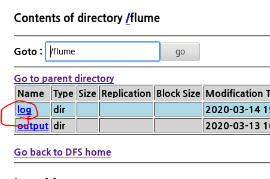
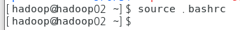
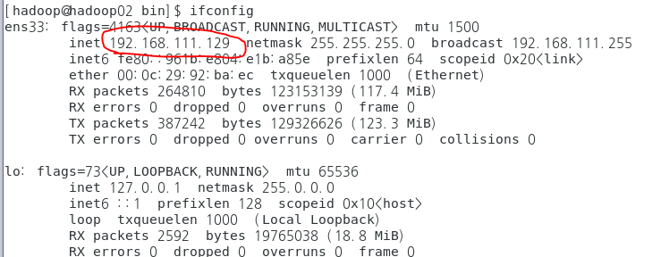
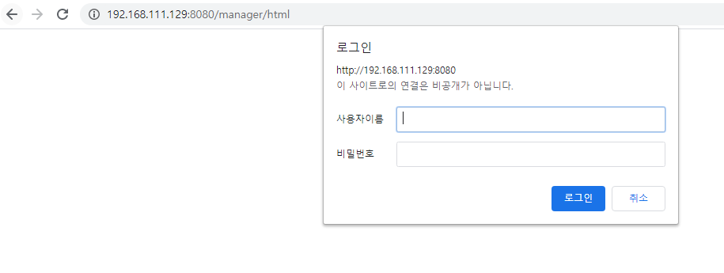

### flume

### : 데이터를 추출하기 위해 사용되는 프로그램

### ===>> 시스템로그, 웹서버의 로그, 클릭로그, 로안로그... 비정형데이터를 HDFS에 적재하기 위해 사용하는 프로그램

### 대규모의 로그데이터가 발생하면 효율적으로 수집하고 저장하기 위해 관리

### ==> flume, chukwa, scribe, fluentd,splunk

#### - 설치

#### wget 명령어로 다운(주소 붙여넣기)

wget http://archive.apache.org/dist/flume/1.6.0/apache-flume-1.6.0-bin.tar.gz

#### 압축풀기

tar -zxvf apache-flume-1.6.0-bin.tar.gz

#### 파일 설정하기

/home/hadoop/.bashrc  에 설정한다

export FLUME_HOME=/home/hadoop/apache-flume-1.6.0-bin

export PATH=$PATH:$FLUME_HOME/bin

(나머지는 하둡 관련임)

#### source를 통해 .bashrc 를 실행

#### template 파일은 이렇게 설정파일을 설정하라는 예시 이므로 cp를 통해 sh파일로 복사한다.(flume-env.sh rename하고 정보등록)

#### 파일을 실행하여 설정해야한다. jdk 홈디렉토리와 jadoop 홈디렉토리를 export로 설정

이때 jdk는 미리 깔아져있는상태여야함

그리고 설정

#### flume 설정파일에 등록

-flume-conf.properties.template을 rename해서 XXXX.properties

  * cp flume-conf.properties.template console.properties

-flume agent의 source,channel,sink에 대한 정보를 등록

* (우리는 기존내용을 다 지우고 했다)

  

  

  

[Flume의 구성요소]

flume의 실행 중인 프로세스를 agent라 부르며 source,channel,sink로 구성

​										(사진 참조: flum 홈페이지)

1. source

   => 데이터가 유입되는 지정(어떤 방식으로 데이터가 유입되는지 type으로 명시)

   agent명.sources.source명.type=값

   1) type

   - netcat : telnet을 통해서 터미널로 들어오는 입력데이터(bind:접속IP, port:접속할 port)

   - spoolDir : 특정 폴더에 저장된 파일(spoolDir : 폴더명)

     

2. channel

   => 데이터를 보관하는 곳(source와 sink사이의 Queue)

3. sink

   =>데이터를 내보내는 곳(어떤 방식으로 내보낼지 정의)

   1) type

   * logger : flume서버 콘솔에 출력이 전달

     flume을 실행할 때  -Dflume.root.logger=INFO,console 를 추가

   * file_roll : file을 읽어서 가져오는 경우(directory : 읽어온 파일을 저장할 output폴더를 명시)

#### [flume의 실행]

 ./bin/flume-ng agent 

--conf conf --conf-file ./conf/console.properties

--name myConsole -Dflume.root.logger=INFO,console

​									\--------------------------

​										source가 talnet으로 입력하는 데이터인 경우

실행 명령어: ./bin/flume-ng agent

옵션

	* --conf : 설정파일이 저장된 폴더명(-c)
	* --conf-file : 설정파일명(-f)
	* --name : agent의 이름(-n)
	* -Dflume.root.logger=INFO,console : flume의 로그창에 기록

 이런 화면에서 멈추게 된다 

서버를 실행한거기 때문에 이렇게 멈추는게 맞다

### telnet 다운(?)

새 터미널을 띄우고

#### telnet을 이용해서 실행(?)

여기서 test라고 입력하게 되면

기본 터미널을 확인해보면

(telnet에서 나오려면 ctrl+] 누르고 엔터 후 quit 입력하면 된다)

#### 플룸 종료

ctrl+C 로 종료

#### 그 후 console.properties rename 한 후 폴더 두개 생성

./conf/console.properties ./conf/myfolder.properties

cd ..

mkdir input

mkdir output

#### myfolder.properties에 들어가서 파일 수정

#### flume 실행

./bin/flume-ng agent -c conf -f ./conf/myfolder.properties -n myConsole

그리고 파일을 input에 넣으면

output폴더에 로그가 남는다.

#### console.properties rename하고 파일 수정 (hdfs)

#### flume 실행

./bin/flume-ng agent -c ./conf/ -f ./conf/hdfs.properties -n myhdfs

그후 inputdata나 json파일을 input폴더에 넣으면

hadoop 확인하면

#### hdfs2.properties를 기존 1파일을 다른이름으로 저장해서 등록하고 내용 작성

​		(플룸홈페이지 참조)

#### hdfs3.properties를 기존 2파일을 다른이름으로 저장해서 등록하고 내용 작성

14번줄은 for문 이용해서 cat 명령어 쓴다는 뜻인듯( 플룸 홈페이지에 설명 있음)

#### hadoop02를 was로 하고 톰캣 설치

그후 명령어로 압축을 푼다(tar -zxvf (압축파일명))

#### hadoop01의 .hashrc 파일을 hadoop02로 복사

scp .bashrc hadoop@hadoop02:/home/hadoop/.bashrc

파일을 실행하여 어떤건 주석처리하고 설정을 입력한다.

그후 적용을 위해 source 명령어

#### 톰캣 실행해서

cf) 톰캣이 실행되지 않은 채로 netstat하면

time_wait가 된다

다시 돌아와서 firefox에 127.0.0.1:8080 을 입력하면

이 화면이 나오면 제대로 된 것이다

#### 계정 설정 

### 저장 후 firefox 창에 127.0.0.1:8080/manager 입력하고 admin/admin 입력

이 화면이 나온다.

그냥 윈도우에서 크롬을 실행하고  아래 주소를 입력하면 화면이 떠야 하지만 안뜬다 

톰캣  아래 주소의 파일로 들어가서 주석하면

가능해 진다.

그 후 나중에 게스트로 들어오게 하려면

밑을

이렇게 자신의 아이피로 수정하면(cmd-ipconfig)

(나중에 집에서도 접속 가능한듯)

그리고 배치를 누른다음 배치가 되면

주소 입력시에 제대로 접속된다. (확실하진 않지만 기존 톰캣을 스프링에서 했다면 지금은 리눅스에서 했다는 뜻인듯)

## 여기에서 퀴즈

1. 3번에 WAS를 구축

2. WAS에 bigdataShop을 배포

3. 3번에 flume을 설치

4. tomcat의 access log를 hdfs에 저장

   * arvo통신

   * hdfs

     /flume/tomcatelog

5. 메일로 제출

   * 3번의 was manager화면에 배포된 목록 캡처
   * hdfs에 저장된 access log캡쳐
   * 각 머신의 flume 설정파일