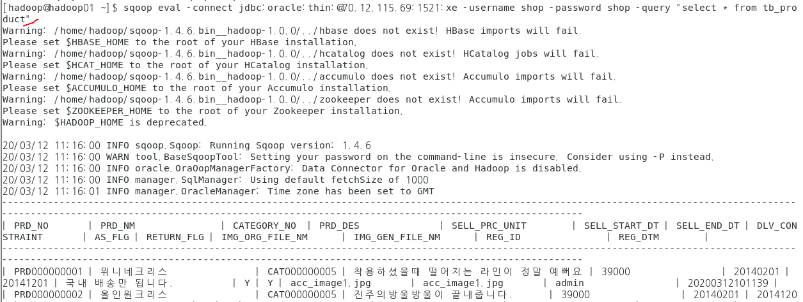

### sqoop 설치 및 설정


#### 다음으로 다운 명령어로 다운링크로 다운 받는다

(wget 명령어)


ls로 파일이 깔렸는지 확인 후 명령어로 압축을 푼다


#### 하둡 홈 디렉토리에 숨겨진 파일인 .bashrc를 수정해야한다.


#### 그 후 명령어로 적용시킨다. (source)

이때 아무것도 명령어 안떠야 정상

source .bashrc


#### 강사님이 주신 파일 스프링으로 실행시켜서 오라클에 데이터 넣기


#### 그 후 ojdbc6.jar 파일을 리눅스 sqoop 홈디렉토리의 lib폴더에 복사한다.


#### scoop 명령어 테스트




#### scoop 이용해서 import

sqoop import -connect jdbc:oracle:thin:@70.12.115.69:1521:xe -username shop -password shop -table tb_product -target-dir /mywork/sqoop/ -as-textfile -columns "prd_no,prd_nm" -m 1


여기서 " -m 1 "은 태스크 개수(?) 


-결과


#### scoop 이용해서 import  (테스크 2개)

sqoop import -connect jdbc:oracle:thin:@70.12.115.69:1521:xe -username shop -password shop -table tb_product -target-dir /mywork/sqoop2/ -as-textfile -columns "prd_no,prd_nm" -split-by prd_no -m 2

(여기서 spitby 쓰는 이유가 뭐였더라)


-결과


#### 반대로 sqoop 이용해서 export하기 

- 먼저 오라클에서 테이블을 생성한다.


* 명령어로 /mywork/sqoop/part-m-00000 내용을 오라클로 

```java
sqoop export -connect jdbc:oracle:thin:@70.12.115.69:1521:xe -username shop -password shop \
> -export-dir /mywork/sqoop/part-m-00000 \
> -table sqoop_result -columns "prd_no,prd_nm"

```


(여기서 \ 표시는 한 칸 띄우기 위함)


* 결과 확인

  

  